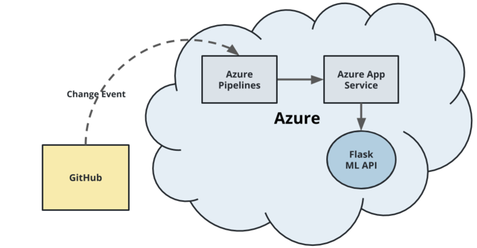
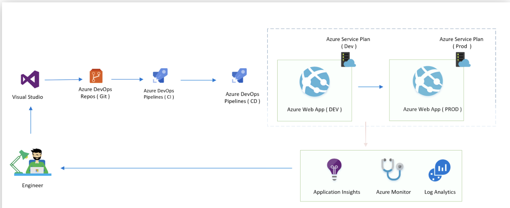
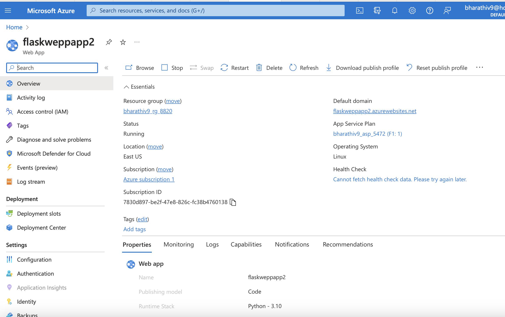
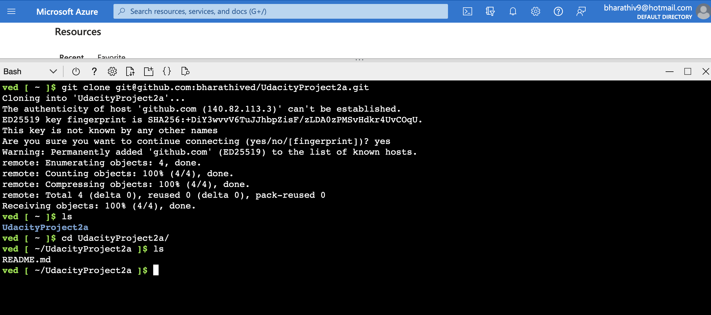
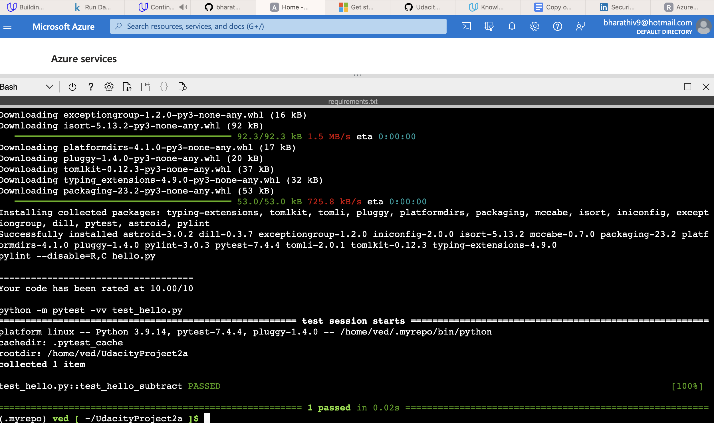
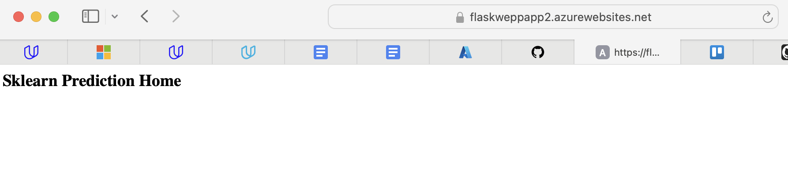
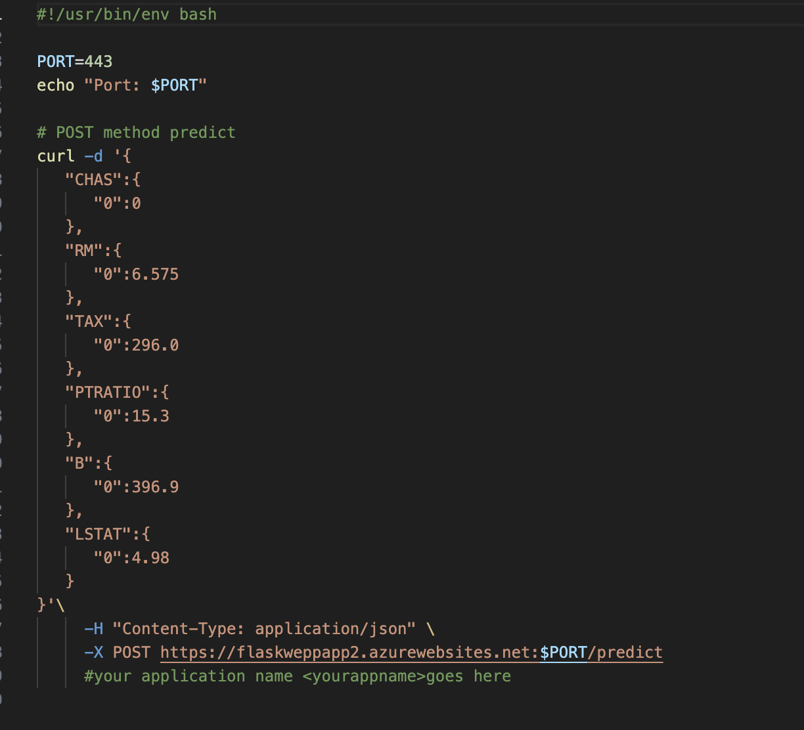
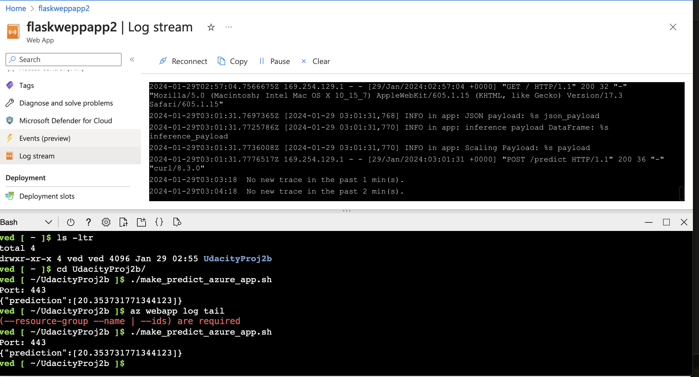

# Overview

This project is to set continuous delivery of Web applicatiob using Azure technologies -Azure Piplelines abd 

## Project Plan
 For the project plan ,we are using trello board to monitor our progress as a team and initial planning for quarter and sprints is done using project management spreadsheet as shown below:

* [Trello board for the project](https://trello.com/b/59stvN3c/udacitynanodegree)
*  [a spreadsheet that includes the original and final project plan](project-management-CICD.xlsx)

## Instructions

Architecture of key parts:  
* 
* 

<h3>  Instructions for running the Python project.  How could a user with no context run this project without asking you for any help.  Include screenshots with explicit steps to create that work. Be sure to at least include the following screenshots:</h3>
 

* Project running on Azure App Service


    
* Project cloned into Azure Cloud Shell


* Passing tests that are displayed after running the `make all` command from the `Makefile`


* Output of a test run

* Successful deploy of the project in Azure Pipelines.  [Note the official documentation should be referred to and double checked as you setup CI/CD](https://docs.microsoft.com/en-us/azure/devops/pipelines/ecosystems/python-webapp?view=azure-devops).

* Running Azure App Service from Azure Pipelines automatic deployment

* Successful prediction from deployed flask app in Azure Cloud Shell.  .
The output should look similar to this:

```bash
udacity@Azure:~$ ./make_predict_azure_app.sh
Port: 443
{"prediction":[20.35373177134412]}
```

* Output of streamed log files from deployed application

> 

## Enhancements
Enhance this project to work on the latest python libraries instead of a specified or specific version.

## Demo 

 
 * [Demo in Youtube ](https://www.youtube.com/watch?v=DYE0yB5NF48)

